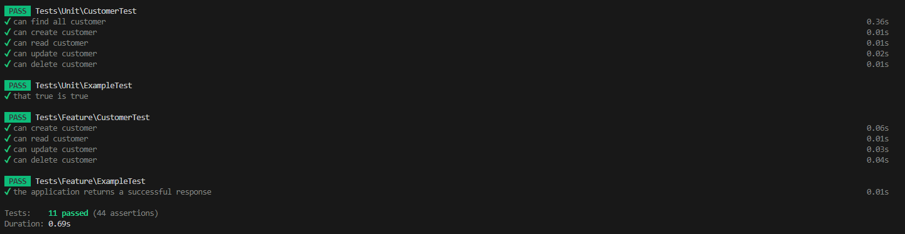

# Laravel CRUD Test Assignment

This repository contains the implementation of my Laravel CRUD Test Assignment. The assignment includes various tasks related to Test-Driven Development (TDD), Domain-Driven Design (DDD), Behavior-Driven Development (BDD), Clean Architecture, and other stuff (all nice challenging 😃). The goal of the assignment is to showcase your understanding and proficiency in these areas. 
I have gathered some steps i've done here:

# Project Structure Overview
Understanding the project structure is essential for maintaining and extending the codebase. Here's an overview of the key directories in the project:
  - App
      - Adapters
          - Presenters
          - ViewModels
      - Application
          - DTO
          - Mappers
          - UseCases
          - Customer
              - Commands
              - Queries
      - Domains
          - Factories
          - Interfaces
          - Models
          - ValueObjects
      - Exceptions
      - Http
          - Controllers
          - Middleware
      - Providers
      - Repositories


Please note that I haven't separated the presentation layer, and all tests are currently in the default Laravel folder. In the future, I might consider placing them within each corresponding layer of the application. The "Adapters" folder is also there for any chance i get to do refactoring needed. I used various resources to adapt the Clean Architecture structure.


## RESULTS
| # 	| Description                                      	| Status 	|
|---	|--------------------------------------------------	|--------	|
| 1 	| TDD                                              	| Done ✅ 	|
| 2 	| DDD                                              	| Done ✅ 	|
| 3 	| BDD                                              	| Done ✅ 	|
| 4 	| Clean architecture (CA)                           | Done ✅ 	|
| 5 	| CQRS pattern                                      | Done ✅ 	|
| 6 	| Clean git commits that shows your work progress. 	| Done ✅ 	|
| 7 	| Use PHP 8.2                               	    | Done ✅ 	|
| 8 	| validate the phone number (Google LibPhoneNumber) | Done ✅ 	|
| 9 	| Store the phone number (varchar(20))              | Done ✅    |
| 10 	| A Valid email and a valid bank account check      | Done ✅ 	|
| 11 	| Customers must be unique in database: By ```Firstname```, ```Lastname``` and ```DateOfBirth```. 	| Done ✅ 	|
| 12 	| Email must be unique in the database.             | Done ✅ 	|
| 13 	| create a pull request (code review)               | Done ✅ 	|
| 14 	| clone the repository in a new github repository in private mode 	| Done ✅    |
| 15 	| share with ID: ```mason-chase```               	| Done ✅    |
| 16 	| Event sourcing                     	| Partially implemented 	|
| 17 	| Docker-compose       	| Done ✅ 	|
| 18 	| Swagger 	|    Done ✅ 	|
| 19 	| Web UI      	| Not yet completed	|
 

I've put a lot of effort into researching and deciding on the architecture (CA). However, I acknowledge that there is still more work and updates needed, especially in addressing the missing presentation layer. I've made a few choices in the implementation, and I plan to continue refining and improving it.

Regarding event sourcing, I have attempted to incorporate the concept of Command-Query Responsibility Segregation (CQRS). It has been a bit challenging, and unfortunately, due to a looming deadline for task delivery, I haven't been able to dedicate as much time to it as I would have liked. However, I recognize its importance and plan to invest more time in exploring and working on it in the future.

## TEST RESULTS
Throughout the project, various aspects have been thoroughly tested. Here are the test results:




# HOW TO USE THE CODE BASE
To get started with the code base, follow these instructions:

##UP AND RUNNING

You can run the entire project as a container using the following commands:

    # for the first time use 
    docker-compose build
    # then run up -d run containers in a dispatched mode
    docker-compose up -d
    
## You may access Swagger documentation

at: http://127.0.0.1/api/documentation
